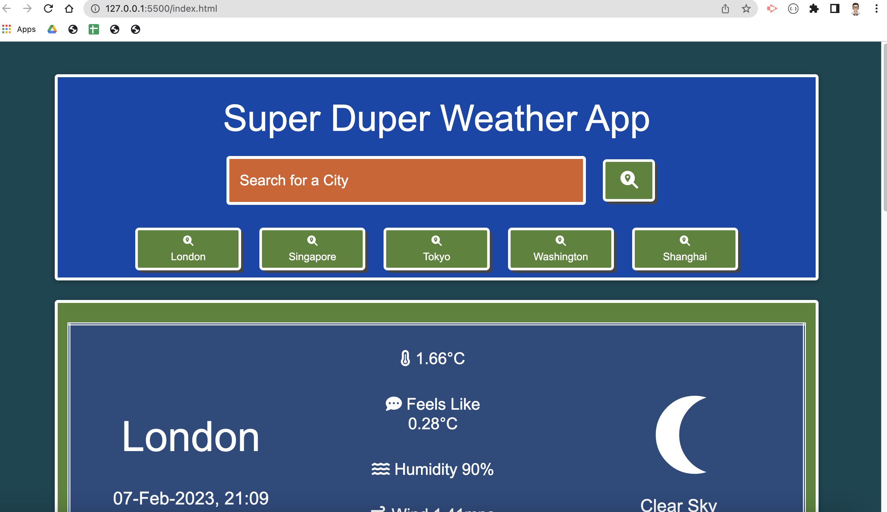
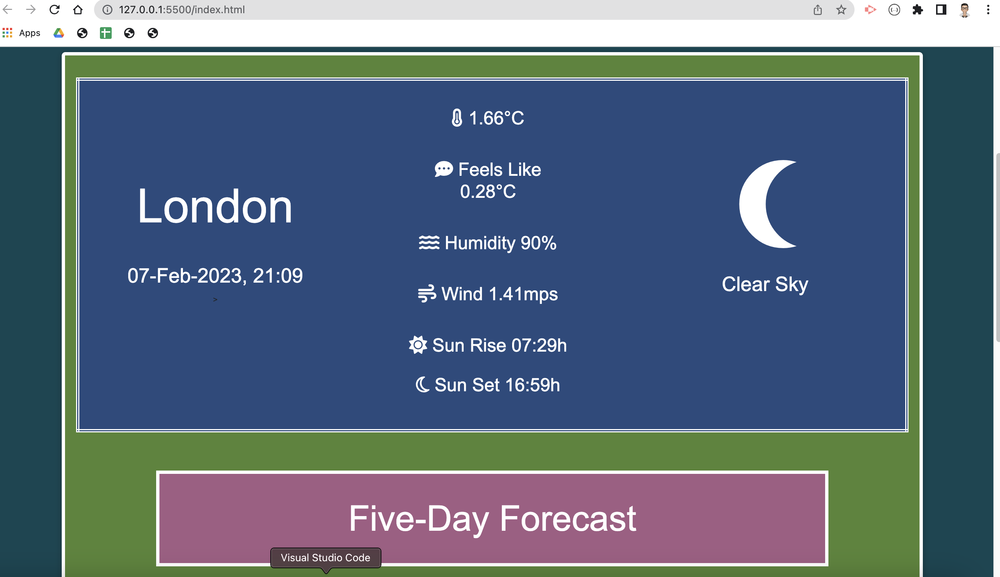
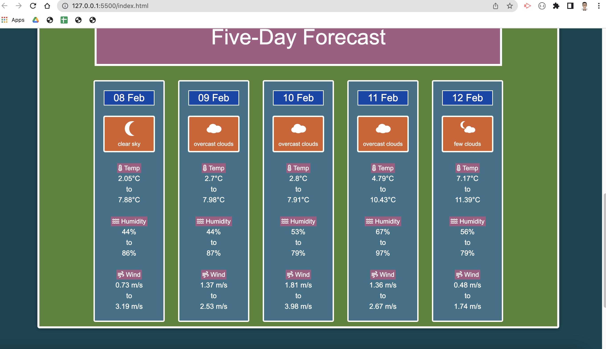
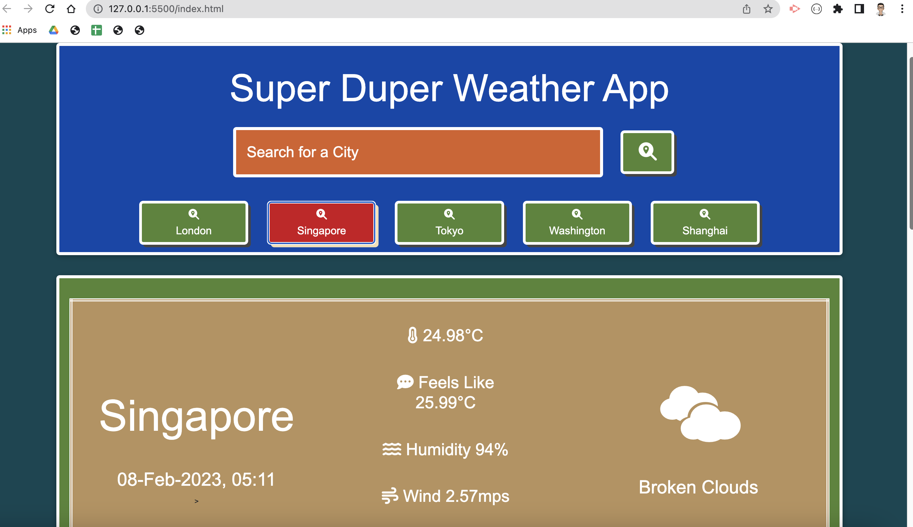
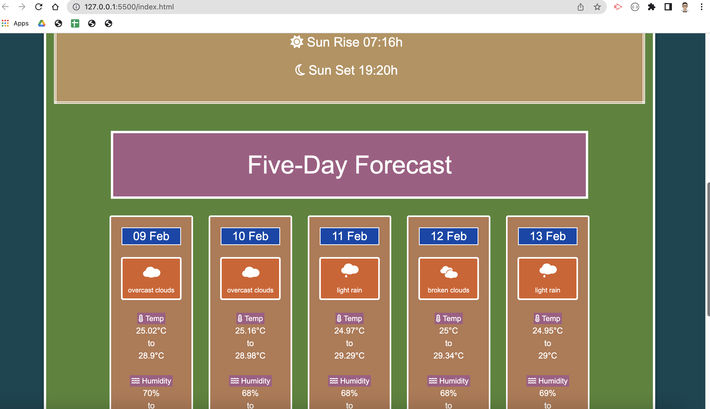
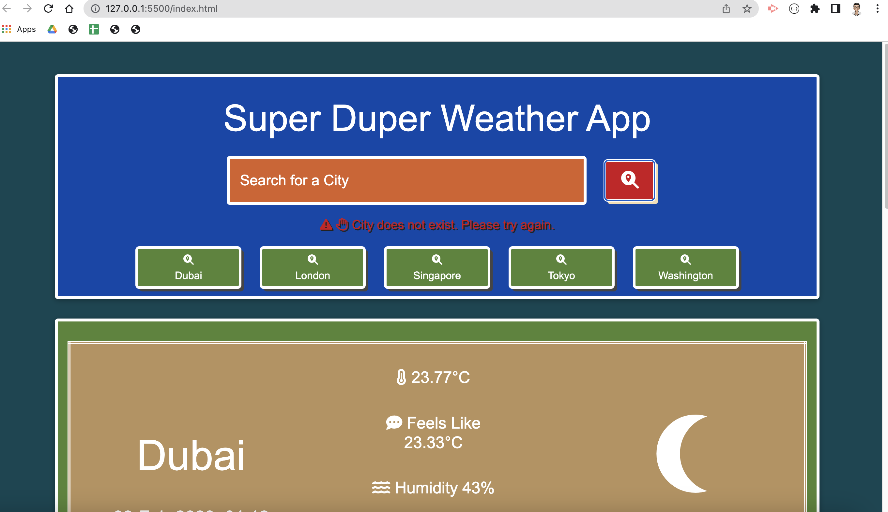

# w08_Five_Day_Weather_Dashboard

## Description

This project is part of the Frontend Dev Bootcamp course challenge for the eighth week "Server APIs". 

It requires us to use server APIs such as openweather and third-party APIs like day.js, JQuery and its UI together JScript objects, client-side storage, browser events to build a Weather app. This weather application should allow a user to view the current weather of a city and its five-day forecast. This app should also allow user to check for the weather of any city provided by openweather. 

The JScript and JQuery will produce the output dyanmically to the webpage pages as part of the starter code provided. I've tried to group repeatedly called JScript codes into modular functions where possible.

### NOTE:
 * That for some reason(s) unknown, the text "testing" is actually a valid city according to openweather API. 
 * A "delete search history" button has been added to clear and reset the pre-set / user search history buttons after the app was submitted for evaluation.
   

### Methodology: Pseudo Code
* Get the OpenWeather APIs for getting the
  * coordinates of a city, 
  * current weather conditions and 
  * five-day weather forecast.
* On page load, render the weather details for a default city (london)
* Create a predefined list of cities to act as "search history" on page load.
  * When a user search for a city, check that it is not already one of the search buttons.
  * If it is not, then discard one of the predefined buttons and add the current user search as search history.
  * This predefined list of cities and the user search history is stored in localStorage.
* Use days.js for date/time conversion. All date/time are read as Unix timestamps and with the UTC time zone offset data provided by OpenWeather, the date/time are comverted to local time.
* render the night and day version of weather icons based on the current local time.
* render different background colours based on current temperature for the current weather or the average temperature for each of the 5-Day forecast.
  

### Further Improvements

* Allow search by postcodes/zip code.
* Allow user input predictive typing using a Google Map API
* Render a royalty-free picture (as background image) of the searched city/location.

## User Story

AS A traveler

I WANT to see the weather outlook for multiple cities

SO THAT I can plan a trip accordingly

[Deployment link: https://havetimedrinktea.github.io/w08_Five_Day_Weather_Dashboard/](https://havetimedrinktea.github.io/w08_Five_Day_Weather_Dashboard/)

## Acceptance Criteria

The app should should act as a weather dashboard with form inputs.
* When a user searches for a city they are presented with current and future conditions for that city and that city is added to the search history
* When a user views the current weather conditions for that city they are presented with:
  * The city name
  * The date
  * An icon representation of weather conditions
  * The temperature
  * The humidity
  * The wind speed
* When a user view future weather conditions for that city they are presented with a 5-day forecast that displays:
  * The date
  * An icon representation of weather conditions
  * The temperature
  * The humidity
* When a user click on a city in the search history they are again presented with current and future conditions for that city

## Table of Contents (Optional)

* [Installation](#installation)
* [Usage](#usage)
* [Credits](#credits)
* [License](#license)
* [Features](#features)

## Installation

N.A.

## Usage 

Screen dump of the deployed webpage:

### Weather App for Default city of London

### Weather App for a predefined city (Singapore)

### error user input treatment

## Credits

* owfont for rendering the weather icons [https://websygen.github.io/owfont/#](https://websygen.github.io/owfont/#)

## License 

MIT License

## Features

### Main Features
* On page load:
  * show the weather of default city (London) at the current time. 
  * show the 5-day forecast for the default city.
  * show a list of 5 predefined city buttons for easy searching. 
  * when user search for a city, the 5 predefined buttons will include the search history.
* The current weather is presented in local time zone and the weather icons will indicate a day and night version where available.
* The 5-day forecast weather shows 
  * the max and min of temperature, humdity and wind speed for the day.
  * the weather icon and description is based on the current local time and the weather forecase for the same time (within a 3hour slot) in the future.
  
### Extra Features
* The rendering of the weather data is against a background colour based on the temperature
* The rendering of weather icon is based on re-designed icons courtesy of owfont (see #Credits).

